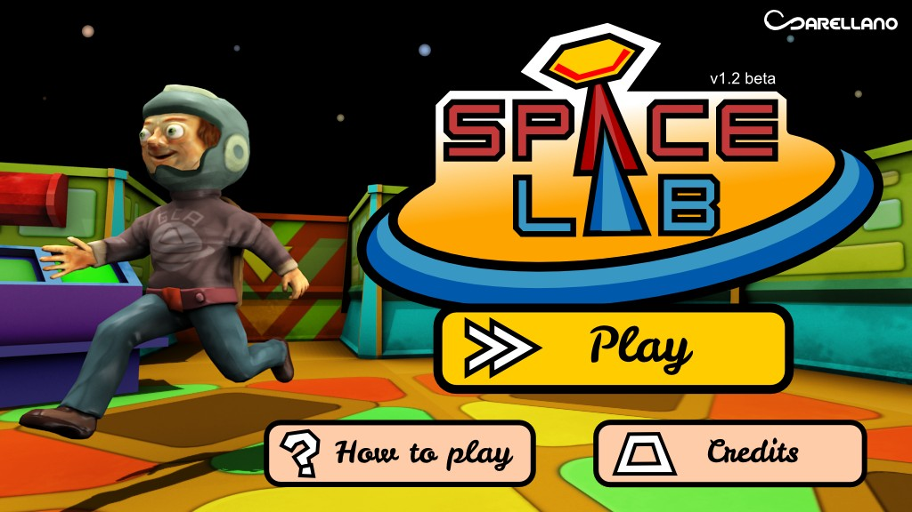
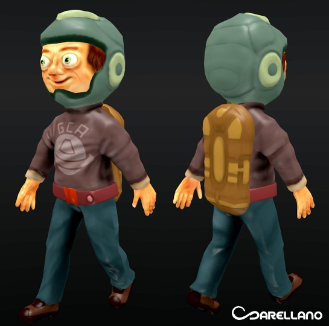
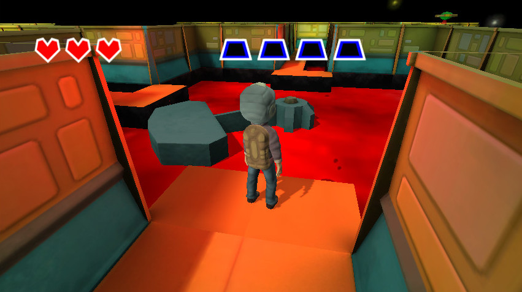
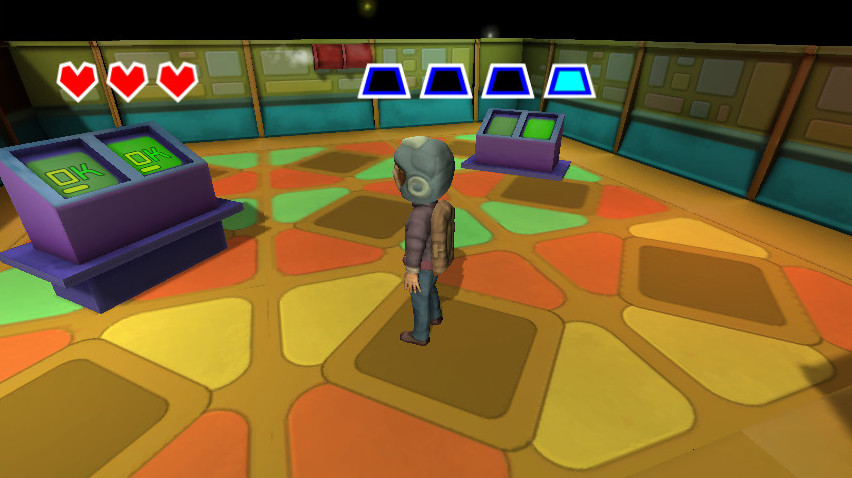

+++
title = "Space lab"
description = "Boot up the lab computers while avoiding enemies, fire, and other hazards."
weight = 80

[extra]
local_image = "projects/spacelab/logo.png"
category = "Games"
+++

**Space Lab** is a 3D top-down arcade game developed with Unity3D for desktop and mobile. Activate every computer in the level to advance, while dodging hazards like fire and enemies.

## Technologies

    
    
    

