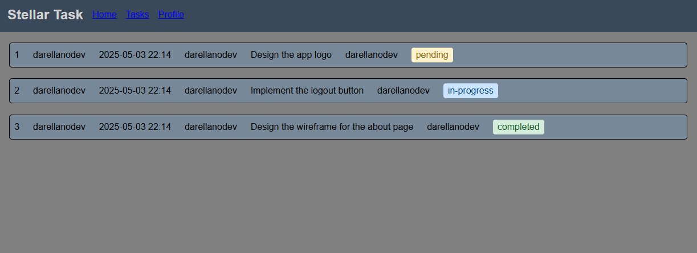

+++
title = "Stellar Task Box"
description = "A simple application to manage projects, to learn Angular and TDD."
weight = 63

[extra]
local_image = "projects/stellartask/logo.png"
+++

**Stellar Task** is a simple application to manage projects, to learn Angular and TDD.

#### [GitHub](https://github.com/darellanodev/stellar-task) • [Try it online](https://darellanodev.github.io/stellar-task/) {.centered-text}

## Technologies

    
    
    
    

**THIS APPLICATION IS IN AN EARLY STAGE OF DEVELOPMENT**
