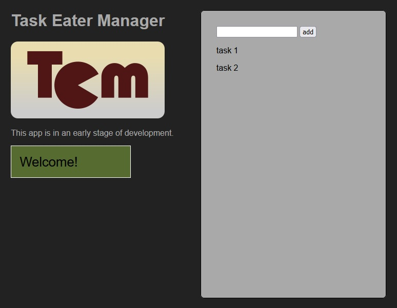

+++
title = "Task Eater Manager"
description = "A clicker style game based on a to-do task management. To learn more about Typescript, Jest, TDD, patterns..."
weight = 30

[extra]
local_image = "projects/taskeatermanager/logo.png"
+++

**Task Eater Manager** is a clicker style game based on a to-do list management for web browser, to learn more about Typescript, Jest, TDD, patterns, ...

#### [GitHub](https://github.com/darellanodev/task-eater-manager)

#### Made with [Typescript](https://www.typescriptlang.org/) | [InkScape](https://www.inkscape.org/)

## Main Features

- **Run in web**: This game can be played in a modern web browser.

## Development Best Practices

- **TDD**: Made with TDD when its possible.
- **OOP**: Using Oriented Object paradigm style.
- **Patterns**: Use patterns like: Oberver pattern, mixing pattern, singleton pattern.
- **Documentation**: Documenting tasks.
