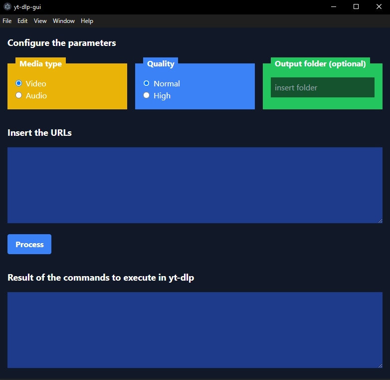

+++
title = "yt-dlp-gui"
description = "This a simple graphical user interface (GUI) for the yt-dlp application for learning purposes."
weight = 40

[extra]
local_image = "projects/ytdlpgui/logo.png"
+++

**yt-dlp-gui** is a simple graphical user interface (GUI) for the yt-dlp application for learning purposes.

#### [GitHub](https://github.com/darellanodev/yt-dlp-gui)

#### Technologies

    
    
    
    
    
    
    
    

## Main Features

- **Desktop (Windows)**: This is an application that can be used in desktop (Windows).

## Development Best Practices

- **Unit testing**: Uses Go testing capabilities to make unit testing.
- **TDD**: Made with TDD when its possible.
- **OOP**: Using Oriented Object paradigm style.
- **Documentation**: Documenting tasks.
