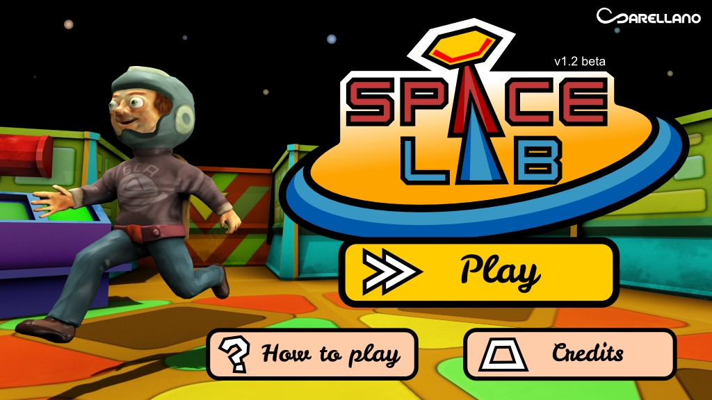
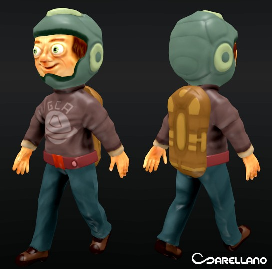
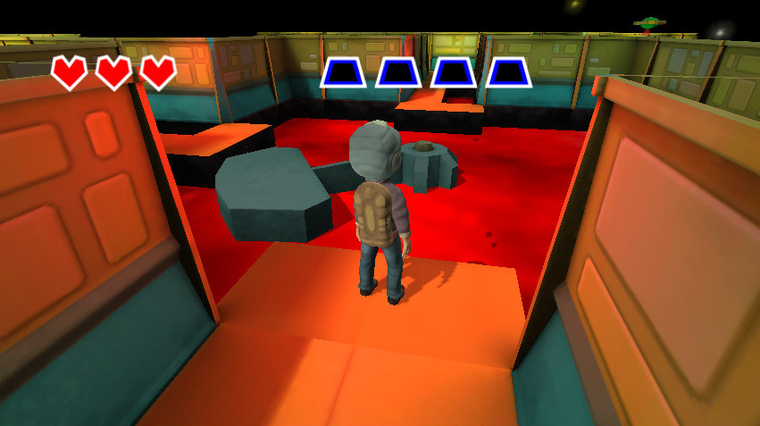
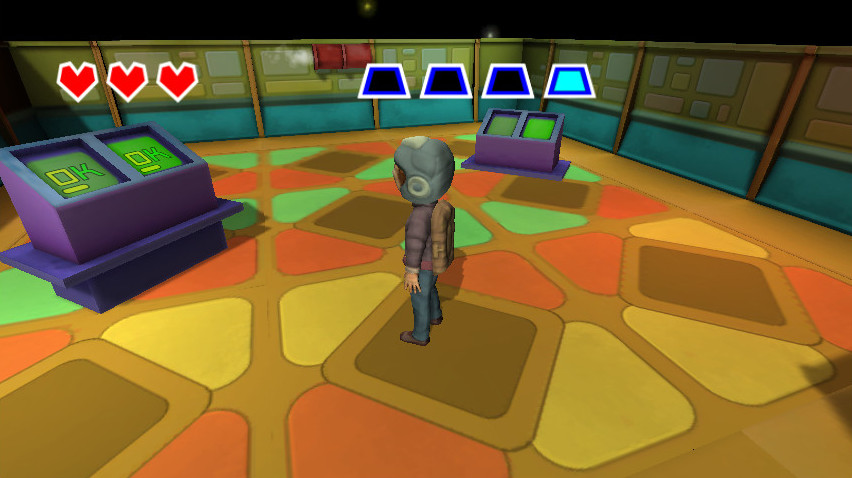

+++
title = "Space lab"
description = "This is a game I developed for desktop and mobile android devices using Unity3d."
weight = 10

[extra]
local_image = "projects_old/spacelab/logo.png"
+++

**Space lab** is a game I developed for desktop and mobile android devices using Unity3d.

#### Made with [Unity3d](https://unity.com) | [Blender](https://www.blender.org) | [Gimp](https://www.gimp.org)

## Main Features

- **Play in android mobile**: This is a game is adapted to play in android mobile devices.
- **Play in desktop (windows)**: This is a game that can be played in windows devices.
- **Play in web**: using the unity web plugin

## Development Best Practices

- **OOP**: Using Oriented Object paradigm style.
- **Documentation**: Documenting tasks.
